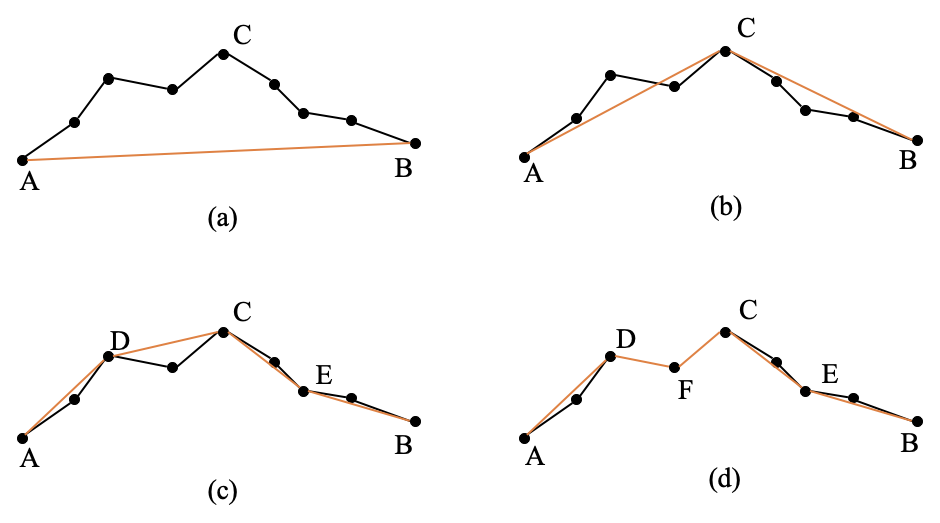

# Interview Code

```shell
mkdir build && cd build
cmake ..
make
```

## 点到线的距离

```shell
./bin/test_dist_pt_to_line # 每次会生成一张 SVG 图, 标示了点/线/距离
```


## Douglas



Douglas_Peucker 算法是对坐标点串进行抽稀的一种算法。步骤如下：


（1）在曲线首尾两点 A，B 之间连接一条直线 AB，该直线为曲线的弦；

（2）得到曲线上离该直线段距离最大的点 C，计算其与 AB 的距离 d；

（3）比较该距离与预先给定的阈值 threshold 的大小，如果小于 threshold，则该直线段作为曲线的近似，该段曲线处理完毕。

（4）如果距离大于阈值，则用 C 将曲线分为两段 AC 和 BC，并分别对两段曲线进行 1~3 的处理。

（5）当所有曲线都处理完毕时，依次连接各个分割点形成的折线，即可以作为曲线的近似。

```shell
./bin/test_douglas
```

